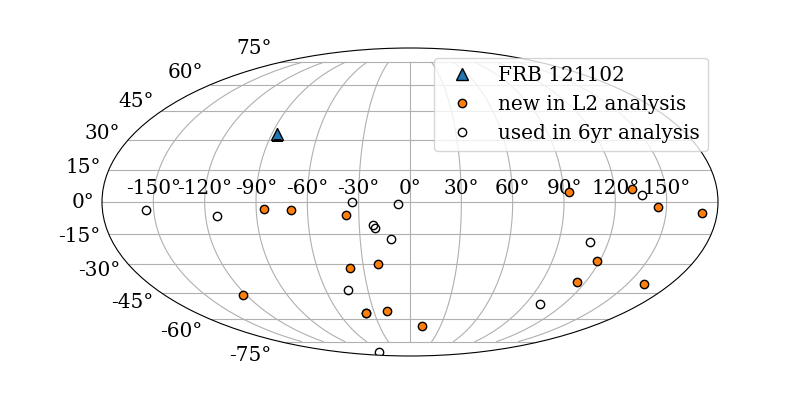

# FRBs-large-effective-area

These scripts conduct an analysis searching for neutrino emission from fast radio bursts (FRBs). 28 bursts are included -- all non-repeating bursts from 2011 to mid-2018.

Two tests are performed.

1. Stacking -- for a given time window size, events coincident with any of the 28 sources contribute to the observation simultaneously. This tests the association of the entire source class with astrophysical neutrinos. Multiple time windows are searched, expanding in duration but always centered on the time of each FRB detection.

2. Max-burst -- for a given time window size, each source's coincident events contribute separately to a signle-source observation. The most signal-like (largest test statistic) observation is recorded. This tests the association of any single brightest source with neutrino emission. Limits are upper limits on the largest neutrino flux from any of the studied sources.

## Environment for reproduction by IceCube members
Python version: eval `/cvmfs/icecube.opensciencegrid.org/py2-v2/setup.sh`

ENV: `/data/user/sfahey/workspace/icerec_V05-00-06/build/env-shell.sh`

## Source list extraction
http://frbcat.org provides the most up-to-date list of verified FRB detections (credit to Petroff et al. 2016). csv_reader.py is built to convert the exportable CSV file from FRBcat into a pickled dictionary that GRBLLH interprets as a source list.

