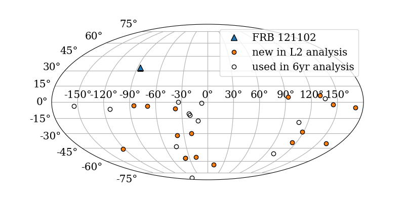

# FRBs-large-effective-area

This repository contains the software I used to perform an analysis in search of correlation of neutrino data with 28 fast radio bursts (all non-repeating bursts detected between 2011 and mid-2018). Information useful for reproduction or review by IceCube members is available after the list of contents. Publication in progress.
***

## Contents

`data_processing/` contains scripts that retrieve and prepare IceCube data for analysis: 
* Read and process IceCube's data structures
* Perform event selection and save final arrays
* Perform random forest regression to estimate event-wise angular uncertainty
* Reduce memory usage of data for building probability distribution functions

`mc_processing/` contains scripts for preparation of analysis MC -- Monte Carlo simulated events.

`source_processing/` contains scripts that convert FRBcat's source CSV into a format readable for analysis and performs topocentric corrections on burst times for millisecond-scale transient studies.

`analysis_scripts/` contains scripts that perform background (control) trials and signal-injection trials for the max-burst and stacking tests. DAGMANs are included ([DAGMan](https://research.cs.wisc.edu/htcondor/dagman/dagman.html) is a job scheduler for University of Wisconsin's distributed computing platform).

`python_software/` contains the bulk of the python framework I use to perform transient analyses with IceCube. Much of the code was written by previous students between 2008 and 2010 for studies of gamma-ray bursts; but when I began using it for different source classes, more functionality was needed. I have continuously debugged and made additions to the contained files, for example:
* Added seasonal variation to background estimators in `pdf.py`
* Debugged and generalized `observed_time_windows` functions in `llh.py`
* Wrote code that alters method of test statistic calculation for very large numbers of contributing events (>1e6)

***

## Analysis information

Two tests are performed.

1. Stacking -- for a given time window size, events coincident with any of the 28 sources contribute to the observation simultaneously. This tests the association of the entire source class with astrophysical neutrinos. Multiple time windows are searched, expanding in duration but always centered on the time of each FRB detection.

2. Max-burst -- for a given time window size, each source's coincident events contribute separately to a signle-source observation. The most signal-like (largest test statistic) observation is recorded. This tests the association of any single brightest source with neutrino emission. Limits are upper limits on the largest neutrino flux from any of the studied sources.

### Environment for reproduction by IceCube members
Python version: eval `/cvmfs/icecube.opensciencegrid.org/py2-v2/setup.sh`

ENV: `/data/user/sfahey/workspace/icerec_V05-00-06/build/env-shell.sh`

### Source list extraction
http://frbcat.org provides the most up-to-date list of verified FRB detections (credit to Petroff et al. 2016). csv_reader.py is built to convert the exportable CSV file from FRBcat into a pickled dictionary that GRBLLH interprets as a source list.

