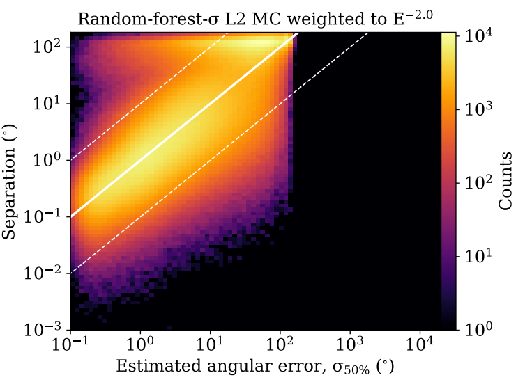

# Data Processing

`convert_l2_df5.py` pulls track fit objects and I3Weights (for Monte Carlo) from IceCube's Level-2 data and saves subruns as hdf5 files.

`agglomerate_subruns.py` loads and compiles subruns into single run files. The script looks up run information in a "GoodRun" file and assigns the livetime, then saves relevant event features for analysis.

`decimate_runs.py` randomly reduces off-time data until its size is small enough to be loaded for parameterization. Each run is saved with 5% of its events and livetime reduced to 5% of its original value to maintain the correct rate.

`decimate_ontime.py` takes a time-window size (dT) and saves only events within dT/2 of any FRB.

## Random forest regressor

`angular_error/make_ideal_forest.py` prepares features, targets, and weights, then it builds the random forest regressor on 4 million background events. The hyperparameters were determined using GridSearchCV. 

`angular_error/apply_forest_to_data.py` assigns angular uncertainty predictions to data, saving the final arrays used in analysis.

`angular_error/apply_forest_to_other.py` applies the forest to other data sets, to compare response from higher level event selections.

***

